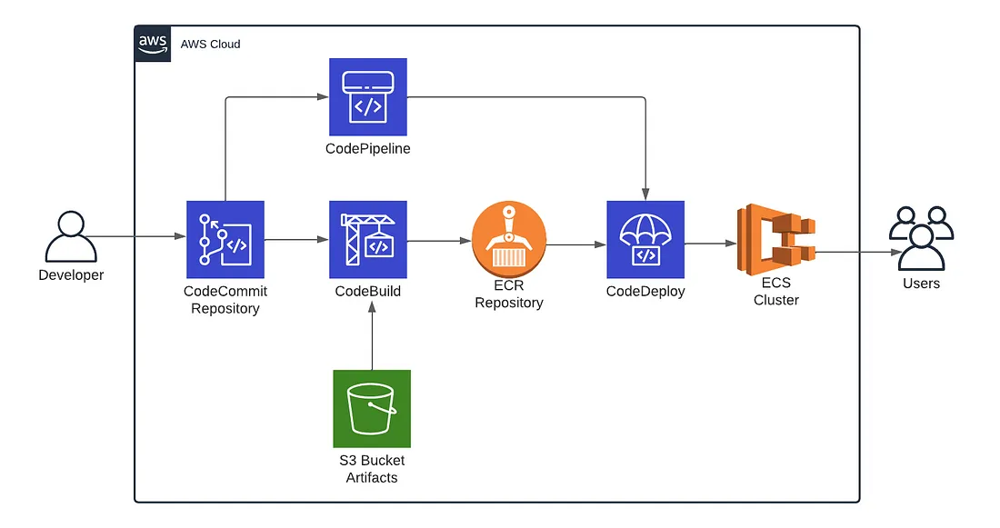

# AWS IAC-DEOPS Environment


## 1-  Install AWS CLI and Terraform CLI

                      ┌────────────────────────────┐
                      │        AWS Region          │
                      │         eu-west-1          │
                      └────────────┬───────────────┘
                                   │
                      ┌────────────▼─────────────┐
                      │        VPC (10.0.0.0/16) │
                      └──────┬──────────┬────────┘
                             │          │
                 ┌──────────▼───┐  ┌────▼─────────┐
                 │ Public Subnet│  │Private Subnet│
                 │ (10.0.101.0) │  │ (10.0.1.0)   │
                 └──────┬───────┘  └────┬─────────┘
                        │              │
         ┌──────────────▼───┐      ┌────▼────────────────────────────┐
         │  ECS Fargate Web │      │  Conditionally one of:          │
         │  (Java WebApp)   │      │                                 │
         │  Public + SG     │      │  1. ECS Fargate (PostgreSQL)    │
         └────────────┬─────┘      │     Private Subnet + SG         │
                      │            │                                 │
                      │            │  2. RDS PostgreSQL DB Instance  │
                      │            │     Private Subnet + SG         │
                      │            └─────────────────────────────────┘
                      │
           ┌──────────▼─────────┐
           │     AWS ECR       │
           │  java-webapp-repo │
           └───────────────────┘


## 2- Create Service User for the profile name: "devops-training-2025 "
Create a service user with the needed rights:

```bash
sh aws/iac/create-terraform-service-user.sh
```

### 3- Deploy Infrastructure
```bash
terraform -chdir aws/iac apply -var="use_rds=false"
```

### 3- Upload Java App docker image to ECR


### 4- Deploy Java App in ecs
```bash
terraform -chdir aws/deploy apply 
```


